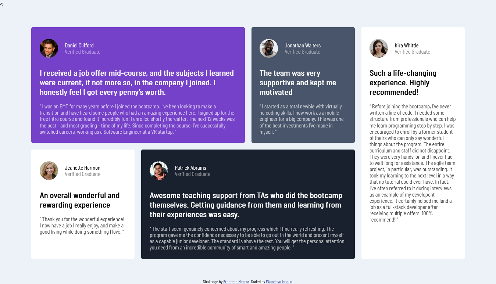

# Frontend Mentor - Testimonials grid section solution

This is a solution to the [Testimonials grid section challenge on Frontend Mentor](https://www.frontendmentor.io/challenges/testimonials-grid-section-Nnw6J7Un7). Frontend Mentor challenges help you improve your coding skills by building realistic projects. 

## Table of contents

- [Overview](#overview)
  - [The challenge](#the-challenge)
  - [Screenshot](#screenshot)
  - [Links](#links)
- [My process](#my-process)
  - [Built with](#built-with)
  - [What I learned](#what-i-learned)
  - [Useful resources](#useful-resources)
- [Author](#author)
- [Acknowledgments](#acknowledgments)

## Overview

### The challenge

Users should be able to:

- View the optimal layout for the site depending on their device's screen size

### Screenshot

### Links

- Solution URL: [https://github.com/Segunstar/testimonials-grid-section](https://github.com/Segunstar/huddle-page-challenge)
- Live Site URL: [https://segunstar.github.io/testimonials-grid-section/](https://segunstar.github.io/testimonials-grid-section/)

## My process

### Built with

- Semantic HTML5 markup
- CSS custom properties
- Flexbox
- CSS Grid

### What I learned

I learned how to use grid boxes by using grid-template-area allowing me make the grids in a very easy way. 

### Useful resources

- [Complete CSS Grid Tutorial with Cheat Sheet ](https://www.freecodecamp.org/news/css-grid-tutorial-with-cheatsheet/) - This website explained the basics of css grid to me, which made me able to solve this challenge perfectly.

## Author

- Name - [Ekundayo Isegun](https://https://github.com/Segunstar)
- Frontend Mentor - [@Segunstar](https://www.frontendmentor.io/profile/Segunstar)
- Linkedin - [Ekundayo Isegun](https://www.linkedin.com/in/ekundayo-isegun-0b1ba9252)

## Acknowledgments

My acknowlegdements to God, my Parents and my Co-designers who has helped me to maintain the web development/design that I am currently learning.

